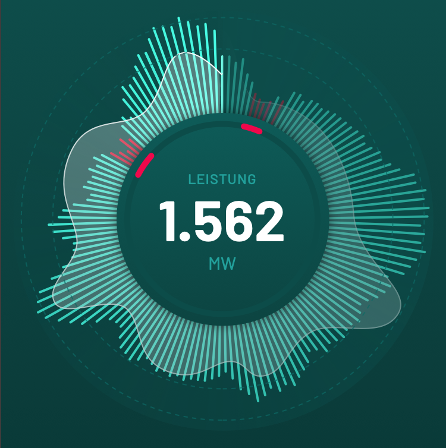

# swift-rose-chart


[](https://github.com/thepeaklab/swift-rose-chart/blob/master/LICENSE)
[](https://twitter.com/thepeaklab)



## Customization


```swift
let roseChartView = RoseChartView()

roseChartView.backgroundColor = color
roseChartView.scaleLineColors = [color1, color2]
roseChartView.scaleBackgroundColor = color
roseChartView.barLineColor = color
roseChartView.stampBackgroundColors = [color1, color2]
roseChartView.stampLineColors = [color1, color2]
```


## Need Help?

Please [submit an issue](https://github.com/thepeaklab/swift-rose-chart/issues) on GitHub.

## License

This project is licensed under the terms of the MIT license. See the [LICENSE](LICENSE) file.